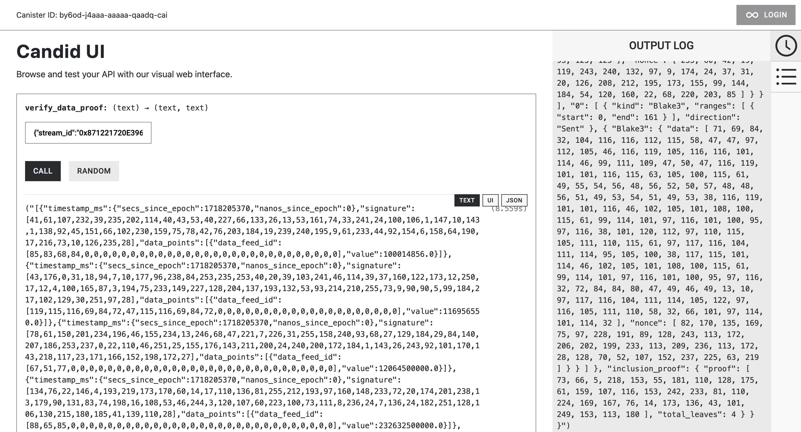
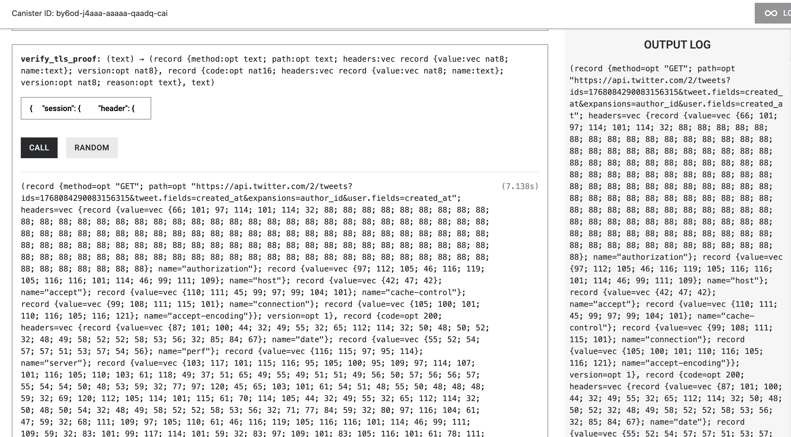

# ICAF canister usage

### 1. Execute local IC network
```bash
dfx start
```
It outputs
```bash
Running dfx start for version 0.20.1
Using the default definition for the 'local' shared network because /home/ubuntu/.config/dfx/networks.json does not exist.
Initialized replica.
Dashboard: http://localhost:32897/_/dashboard
```

### 2. Deploy the ICAF canister
```bash
cd packages/canisers
dfx deploy ic_af
```
It outputs
```bash
...
Finished `release` profile [optimized] target(s) in 0.47s
Installing canisters...
Upgrading code for canister ic_af, with canister ID by6od-j4aaa-aaaaa-qaadq-cai
Module hash 91a0be9510fc9a0164df6ddf64354f20f54c7caf4729ed5776759367f03cddab is already installed.
Deployed canisters.
URLs:
  Backend canister via Candid interface:
    ic_af: http://127.0.0.1:4943/?canisterId=bd3sg-teaaa-aaaaa-qaaba-cai&id=by6od-j4aaa-aaaaa-qaadq-cai
```

### 3. Open the canister on a browser
Copy and paste the sample data `fixtures/data_package.json`



and `fixtures/twitter_proof.json`



we can get corresponding pairs of parsed data and its signature.